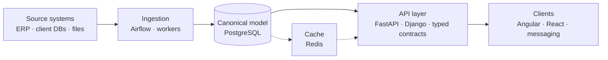

<h1 align="center">Henry Fernández</h1>

<b>Senior Fullstack Engineer &amp; Software Architect</b> 
Colombia · Available for contract work

  
  
  

---

I design and build systems for companies that have outgrown their tooling — legacy ERPs with no API, reporting stacks that stopped scaling, manual processes that should have been pipelines.

Most of my work sits at the boundary between **product engineering and data infrastructure**: the application layer people see, and the ingestion, modeling and automation underneath that makes it trustworthy.

**What I typically own on an engagement**

- Architecture decisions, documented — trade-offs, constraints and the reasoning behind them, not just the outcome
- Backend and API design: Python/FastAPI, Django, Node.js/TypeScript
- Frontend delivery: Angular, React
- Data platform work: PostgreSQL, SQL Server, Airflow, Redis, BI replacement and migration
- Process automation where no integration point exists: RPA, document extraction, scheduled workers

### How I usually structure things

The recurring idea: a **canonical contract** in the middle, with adapters at the edges. Sources change, clients change, the model in the middle stays stable.

### Selected work

| Project | What it is |
|---|---|
| [`fastapi-grafana-demo`](https://github.com/henryjfv/fastapi-grafana-demo) | Instrumented FastAPI service with metrics and Grafana dashboards |
| [`mi-alacena`](https://github.com/henryjfv/mi-alacena) | TypeScript app for household inventory tracking |
| [`CV`](https://henryjfv.github.io/CV/) | Full background and engagement history |

### Stack

**Languages** — TypeScript · Python · JavaScript · Java · Dart · SQL
**Backend** — FastAPI · Django · Node.js/Express · REST · Pydantic
**Frontend** — Angular · React · Vue · Flutter
**Data** — PostgreSQL · SQL Server · Airflow · Redis · Power BI
**Infra** — AWS · Azure · Docker · GitHub Actions

---

Open to freelance and contract engagements · <a href="https://www.linkedin.com/in/henryjosefernandez-villarreal/">Get in touch</a>

