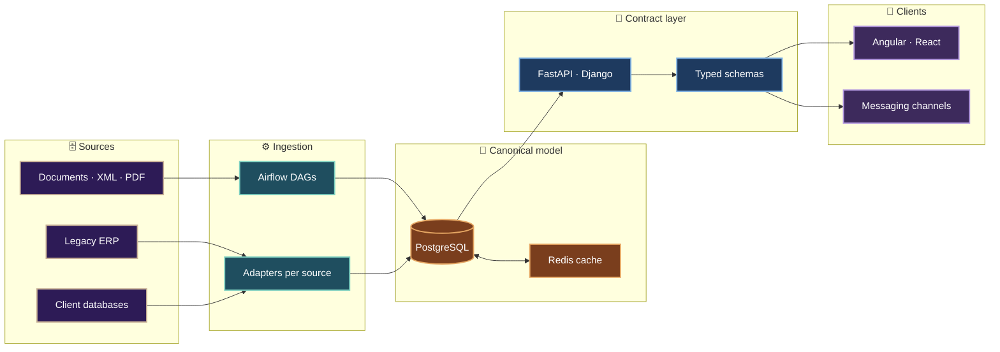
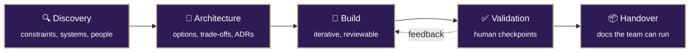

<h1 align="center">Henry Fernández</h1>

  <b>Senior Fullstack Engineer &amp; Software Architect</b> 
  Colombia · Available for contract work

  
  
  
  

---

I design and build systems for companies that have outgrown their tooling — legacy ERPs with no API, reporting stacks that stopped scaling, manual processes that should have been pipelines.

My work sits at the boundary between **product engineering and data infrastructure**: the application layer people see, and the ingestion, modeling and automation underneath that makes it trustworthy.

 

## 🏛️ How I architect systems

The recurring idea: a **canonical contract** in the middle, adapters at the edges. Sources change, clients change, the model in the middle stays stable.

 

## 🔄 How an engagement runs

Decisions get written down. Every non-obvious choice ends up as an ADR — the constraint, the options considered, what was picked and why. Clients keep the reasoning after I leave.

 

## 🛠️ Technologies I work with

<table>
<tr><td><b>Languages</b></td><td>

</td></tr>

<tr><td><b>Backend</b></td><td>

</td></tr>

<tr><td><b>Frontend</b></td><td>

</td></tr>

<tr><td><b>Data</b></td><td>

</td></tr>

<tr><td><b>Infra</b></td><td>

</td></tr>

<tr><td><b>Automation</b></td><td>

</td></tr>
</table>

 

## 📂 Selected work

| Project | What it is | Stack |
|---|---|---|
| [`fastapi-grafana-demo`](https://github.com/henryjfv/fastapi-grafana-demo) | Instrumented API service with metrics and dashboards | `Python` `FastAPI` `Grafana` |
| [`mi-alacena`](https://github.com/henryjfv/mi-alacena) | Household inventory tracking app | `TypeScript` |
| [`CV`](https://henryjfv.github.io/CV/) | Full background and engagement history | `Web` |

 

---

  Open to freelance and contract engagements 
  

